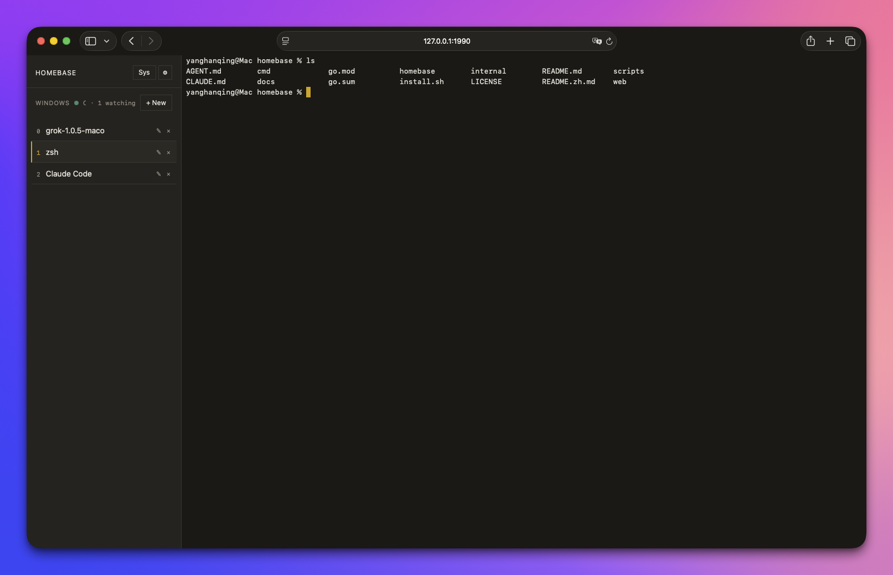

# Homebase

*[English](README.md)*

**用浏览器接管常开机器上的终端——在手机上，在笔记本上，在任何地方。**



## 这是什么

你有一台一直开着的机器：桌子底下的 Mac mini、一台基本不关机的 MacBook、柜子里的一台 Linux。你在上面跑一些长时间运行的东西——Claude Code、Grok Build、一次编译、一次训练，或者只是一个普通的 shell。

Homebase 是一个跑在这台机器上的 Go 单文件程序，它把这台机器的终端搬进浏览器。在手机上打开一个网址，你回到的是**离开时那个正在运行的会话**：同样的滚动历史、同样的进程、同样那条打了一半的命令。关掉标签页、合上笔记本、在隧道里断网——什么都不会中断，因为会话本身根本不在浏览器里。

手机上不用装 SSH 客户端，路由器上不用做端口转发，也不需要把任何东西暴露到公网。

**如果你已经熟悉 tmux 和 Tailscale**：Homebase 就是本机某一个固定 tmux session 的 Web 前端，通过你的 tailnet 访问，唯一的凭证是设备配对。可以直接跳到[安装与启动](#安装与启动)。

**如果不熟悉**，读下面这一节就够了。

## 它依赖的两样东西

Homebase 之所以小，是因为这两个问题它没有自己解决，而是交给了两个成熟的工具。你不需要深入学它们，但应该知道各自负责什么。

### tmux——让你的工作活下来的，是它

正常情况下，一个终端会话属于打开它的那个窗口。窗口一关、SSH 一断，里面跑的东西就跟着死了。长任务跑到一半掉线之所以让人恼火，原因就在这里。

**tmux**（终端复用器）切断了这层绑定。它把你的 shell 跑在一个后台常驻的 session 里，你的终端窗口只是**接上**（attach）这个 session 并把它画出来。断开——无论是你主动的，还是 Wi-Fi 掉的——session 都原样继续跑。换个地方重新接上，画面还在原处。

Homebase 建立的全部基础就是这个特性：浏览器只是又一个接上来的客户端。**会话状态从来不在 Homebase 手里，而在 tmux 手里**，所以关掉标签页是安全的。

用 Homebase 并不需要你去背 tmux 的快捷键，常用操作侧边栏都替你做了：

- 侧边栏的每一行是一个 tmux **window**，可以当成标签页看。点击切换，`+` 新建，也可以重命名和关闭。
- 你看到的滚动历史是 tmux 的，不是浏览器的——所以它能扛过一次重连。

同时，你原本会的东西一样有效：tmux 自己的快捷键（分屏、复制模式）全都在，因为你面对的就是一个真正的 tmux 客户端。

装 Homebase 之前先装它，没有 tmux，Homebase 无法运行：

```bash
# macOS（Homebrew）
brew install tmux

# Debian / Ubuntu
sudo apt install tmux

# Fedora
sudo dnf install tmux

# Arch
sudo pacman -S tmux
```

### Tailscale——让你能连上这台机器的，是它

家里的机器在路由器后面，从外面看它没有任何可以拨通的地址。传统解法都不太好：做端口转发把 SSH 挂上公网，或者租一台跳板机，或者跑一个内网穿透服务。

**Tailscale** 是一个不需要配置的 VPN。在宿主机和手机上都装好，用同一个账号登录，每台设备就会拿到一个 `100.x.y.z` 段的固定私有地址，在任何网络下都能用——咖啡店、蜂窝数据、另一个国家。设备之间的流量端到端加密，且从不经过任何公网端口。不用配路由器，不用加防火墙规则，不用固定 IP。个人设备用免费额度就够了。

Homebase 的整套地址策略正是建立在这上面：默认**只**绑定回环地址和你的 Tailscale 地址，并且拒绝绑定任何公网地址。因此：

- **Homebase 自身走明文 HTTP，没有 TLS**，这是有意为之。加密是 Tailscale 的职责，做两遍并不会更安全。
- 也正因如此，在没有 Tailscale 的普通局域网里，你敲的每个字符对同网段的其他人都是可见的。走这条路之前请先读[安全模型](#安全模型)。

在 [tailscale.com/download](https://tailscale.com/download) 下载，宿主机**和**每一台你想用来连接的设备都要装。

> **已经在用 WireGuard、ZeroTier 或别的 overlay？** 一样可以。Homebase 默认的信任网段是 Tailscale 的 `100.64.0.0/10`，在 Settings 里改成你自己的网段即可。

## 安装与启动

在那台常开的机器上：

```bash
curl -fsSL https://github.com/yanghanqing/homebase/releases/latest/download/install.sh | sh
```

这条命令会下载一个已签名的发布版二进制（并对照 release 的 checksums 校验），放到 `~/.local/bin/homebase`，除此之外什么都不装。之后再次运行同一条命令就是**升级**——它会原子替换掉原来的二进制。升级之后执行一次 `homebase restart`，新版本才会生效。

然后：

```bash
homebase start
```

这会把 Homebase 注册成一个开机自启的后台服务（macOS 是 launchd agent，Linux 是 systemd user unit）并打印出网址。

**在宿主机本机**打开这个网址（默认是 [http://127.0.0.1:1990](http://127.0.0.1:1990)）。你应该立刻看到一个终端，不需要登录——那是回环地址，能访问到它本身就意味着你已经在这台机器上了。

到这里，本机部分就完成了。剩下的都是关于怎么从别的地方连过来。

## 从手机或另一台电脑连接

下面这些在宿主机上做一次就行。

**1. 确认两台设备的 Tailscale 都在运行**，并且登录的是同一个账号。在宿主机上执行 `tailscale ip -4` 可以看到它的 `100.x.y.z` 地址。

**2. 配对设备。** 在宿主机的终端里：

```bash
homebase pair
```

它会打印一条一次性链接：

```
Open this link on the device you want to pair:

    http://100.101.102.103:1990/pair?t=9f2a6c1e4b7d8a3f5c0e1b2d3a4f5c6e

Valid until 21:45:10 (10 minutes), single use only.
```

**3. 在另一台设备的浏览器里打开这条链接。** 它会把这个令牌换成一个长期有效的 cookie。此后这台设备直接访问 `http://100.101.102.103:1990` 就是终端了——存成书签，或者添加到手机主屏幕。

链接 10 分钟内有效，且只能用一次。每台设备配对一次即可。

为什么是链接而不是密码？因为你必须先能在这台机器上跑命令，才能拿到它——而"能在这台机器上跑命令"恰好就是 Homebase 交出去的能力。所以配对不会额外授予任何权限，这也是这里既不需要注册账号、也没有密码可忘的原因。

已配对的设备可以在 Settings 里查看和撤销，该页面只在从宿主机的 `127.0.0.1` 访问时可见。

### 不用 Tailscale，只走局域网

如果你不想用 Tailscale，只希望家里同一个网络下的设备能连上：在宿主机上打开 Settings → 访问范围，选择**「所有局域网」**，然后照上面配对。保存后服务会自动重启。命令行等价写法：

```bash
homebase access lan && homebase restart
```

请清楚你选择了什么：这是局域网上的**明文 HTTP**。同网段的任何人都能读到你敲的每个字符和终端打印的全部内容，也能直接从线路上截走会话 cookie。在自家 Wi-Fi 上这可能是个可以接受的取舍，在咖啡店或办公室 Wi-Fi 上则不是。那段红色确认文案说的就是这件事。

无论哪个档位，Homebase 都不会绑定公网地址。没有任何配置项、也没有任何命令行参数能把它放到公网上。

### macOS：提前开启完整磁盘访问权限

如果宿主机是 macOS，趁你人还在机器前面，现在就做这件事。

把 **Homebase 这个可执行文件**加到 系统设置 → 隐私与安全性 → 完全磁盘访问权限。安装器把它放在 `~/.local/bin/homebase`，展开后是 `/Users/<你的用户名>/.local/bin/homebase`，`install.sh` 结束时会打印这个绝对路径。如果你设过 `HOMEBASE_INSTALL_DIR`，用那个路径。

macOS **不会**为此弹窗，程序自己也无法申请这个权限。不提前设好的话，等你人在外面、只有手机、这台机器又没开屏幕共享时，Homebase 第一次要读「文稿」「桌面」「下载」这些目录，系统会静默拦住，而你没有任何办法远程点「允许」。

`~/.local` 是隐藏目录，Finder 普通浏览看不到：

1. 点 **+**。
2. Finder 菜单 **前往 → 前往文件夹…**（⇧⌘G）。
3. 粘贴 `~/.local/bin`，回车。
4. 选中名为 `homebase` 的**文件**（不是文件夹）。

也可以把这个文件直接拖进列表。只授权文件夹、或者授权了另一份拷贝，都不算数。升级仍是同一路径，所以一般只需要做这一次。

## 命令

| 命令 | 作用 |
| --- | --- |
| `homebase start` | 注册为用户级后台服务并启动 |
| `homebase stop` | 停止服务。配置文件和 tmux session 都不受影响 |
| `homebase restart` | 先 stop 再 start——升级二进制后执行 |
| `homebase status` | 是否在运行、启动时间、bind 地址、URL、tmux 路径、版本、是否需要配对、已配对设备数 |
| `homebase pair` | 打印一次性登录链接：10 分钟有效，只能用一次 |
| `homebase version` | 打印构建版本号 |

不带参数运行 `homebase` 只打印帮助，不启动任何东西。

一台机器只需要跑一份。已在运行时再执行 `start` 不会起第二个实例，而是打印当前正在使用的地址。端口 1990 被占用时会依次尝试 1991、1992……并记住最终用的端口。

另外还有一个 `homebase serve`，它是 `start` 注册给系统服务管理器的前台进程，除了调试之外你不需要手动调用它。

## 安全模型

Homebase 交给浏览器的是一个 shell。把它接到任何网络之前，请先读完这一节。

**Homebase 走明文 HTTP，没有 TLS，也没有任何配置项能打开 TLS。** 传输加密属于 overlay 网络——Tailscale、WireGuard，或任何你已经信任的方案——这也正是默认档位只绑定回环地址和 Tailscale 网段的原因。在普通局域网里，同网段的任何人都能看到你敲的每一个字符和终端打印的全部内容，也能直接从线路上截走会话 cookie 或配对链接。Settings → 访问范围 → 「所有局域网」那段红色确认文案说的就是这件事。

**访问范围（私有 / 局域网）是唯一一个与安全相关的配置项。** 它决定服务监听哪个地址，而认证要求——是否需要配对——是从这个地址**派生**出来的，不能单独配置。也就是说，不存在「监听可路由地址但免凭证」这种组合。Homebase 从设计上拒绝绑定任何公网可路由地址或 `0.0.0.0`，`-listen` 参数也覆盖不了这一点，因此即便配置有误，也不会把一个没有保护的端口放到公网上。

**回环地址（`127.0.0.1`）免配对可访问**，其他任何地址都要求已配对的设备。配对不会授予任何额外能力，因为执行 `homebase pair` 的前提是你已经能在这台机器上跑命令，而这恰恰就是 Homebase 交出去的能力。

**这套模型的前提是：宿主机不与他人共用。** 由于回环免凭证，机器上任何其他本地账号都能访问 `http://127.0.0.1:1990`，拿到一个以 Homebase 运行用户身份执行的 shell。在个人 Mac 或自己的 Linux 机器上，这和他们本来就能拿到的 shell 没有区别；但在多用户共用的主机上，这是一次本地提权。不要把 Homebase 跑在一台你不愿意把终端交给其他本地账号的机器上。

**凭证只以哈希形式保存**在本机的 `devices.json` 里。明文的一次性令牌和会话密钥各自只出现一次——分别在 CLI 的标准输出和浏览器的 cookie 中。撤销设备在 Settings 页面完成，该页面只在回环连接下可见。

报告安全漏洞请见 [SECURITY.md](SECURITY.md)，不要开公开 issue。

## Homebase 不是什么

这些是有意的取舍，方便你快速判断它是不是你要的工具：

- **不是多主机工具。** 一个二进制只驱动它自己所在的那台机器。没有 ssh，没有主机列表，不能在服务器之间跳。
- **不是 TLS 服务器。** 见上文，那是 overlay 网络的事。
- **不是多用户系统。** 没有账号、没有密码、没有角色。一个人，和他的几台设备。
- **不是一个有自己主张的终端模拟器。** 分屏、布局、复制模式都是 tmux 的，用法和你原来一样。
- **不是文件管理器。** 没有上传、没有 SFTP、没有会话录制。

如果你需要的是用不同账号 SSH 到任意主机，那你要的是另一个工具。

## 从源码构建

需要 Go 1.24+ 和 tmux。没有前端构建步骤。

```bash
git clone https://github.com/yanghanqing/homebase
cd homebase
go build -o homebase ./cmd/homebase
./homebase start
```

## 参与贡献

欢迎提 issue 和 PR——开发流程见 [CONTRIBUTING.md](CONTRIBUTING.md)，更重要的是里面写明了哪些方向不在范围内。安全问题走 [SECURITY.md](SECURITY.md) 的私密通道，不要开公开 issue。

## 许可

[MIT](LICENSE)。
