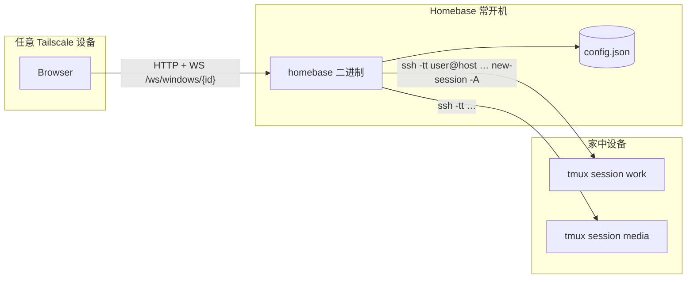
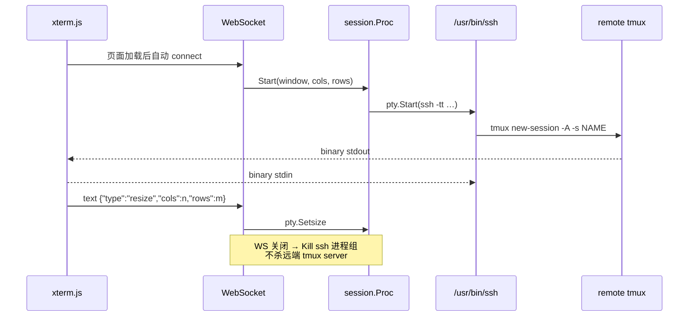

# Homebase 技术方案

| 字段 | 值 |
| --- | --- |
| 状态 | Accepted |
| 日期 | 2026-08-19 |
| 范围 | V1 |
| 配套 | [`../AGENT.md`](../AGENT.md) 是给实现 agent 的硬合同；本文是理由与细节。实现顺序见 [`PLAN.md`](PLAN.md)。 |

Homebase 是跑在家庭常开机器上的 **dumb PTY 桥**：浏览器里的 xterm.js 看到的就是普通 tmux 客户端（状态栏、`C-b`、分屏都是 tmux 自己画的）。持久化在远端 tmux，不在 Homebase。禁止 `tmux -D`，以免把其它客户端踢掉。

V1 已定稿。实现按 PLAN 顺序写；改听口、SSH argv、PTY 寿命、WebSocket 帧、resize、重连之前先改本文和 AGENT.md。

---

## Overview

问题：家里有多台机器，每台上面挂着长期 tmux。从笔记本、iPad、另一台电脑回到这些会话，现在依赖「记得 host、记得 session 名、手动 ssh、手动 attach」，而且浏览器或 SSH 客户端一关，本地的终端视图就没了。真正的状态在远端 tmux 里，但入口太散。

方案：在 Mac mini（Tailscale 节点）上常驻一个 Go 单二进制。浏览器打开它，左侧是已配置的 Window 列表（host + 固定 tmux session 名），右侧是 xterm.js。页面加载后 **自动为每一个 Window 建立** `ssh -tt … tmux new-session -A -s <name>`。WebSocket 断了就指数退避重连；tmux 的 `-A` 幂等 attach，历史靠 tmux 缓冲区，不靠 Homebase 存输出。

访问路径只有 Tailscale（或显式配置的内网地址）。默认拒绝 `0.0.0.0`。

---

## Background & Motivation

- 会话持久化已经有了：tmux。缺的是 **从任意设备一键回到全套会话** 的入口。
- 现成 Web 终端（gotty / ttyd / Wetty）是「把一个本地进程丢到浏览器」，不做多 host 配置列表，也不默认 `tmux new -A`。
- Homebase 做的是「很多 host，每个 host 一两个长期 session，用浏览器从任意设备回去」。
- 约束来自部署：家庭机器，不想装 Node、不想维护容器、不想公网暴露、一个文件拷过去就能跑。

目标负载：单个操作者，≤ 32 个 Window，每个浏览器上每个 Window 一条 ssh。这不是多租户 SaaS。延迟目标：本机/Tailscale 内击键回显 < 50ms 量级，不在 Homebase 里做自适应缓冲。

---

## Goals & Non-Goals

### Goals

1. Window 列表的增删改查，配置落在服务端 JSON。删配置不影响远端 tmux session。
2. 每个 Window 独立 xterm.js + 独立 WebSocket，完整 VT100/ANSI，能跑 vim / htop / less / tmux 状态栏。
3. 打开页面 = 自动连接全部 Window。
4. 容器尺寸变化实时同步到 pty（`pty.Setsize`）。
5. WebSocket 断线自动重连（1s → 2s → 4s → … cap 30s，不停）。
6. 默认只绑 Tailscale IPv4 或 `127.0.0.1`；SSH 只用已有密钥。
7. 单一静态二进制，`embed` 前端。

### Non-Goals（V1 明确不做）

- 多用户、注册、权限、OAuth
- Electron / Tauri / 任何桌面壳
- `tmux -CC`、自绘分屏、把 tmux window 映射成浏览器 Tab
- 密码登录、保存 SSH 密码
- SFTP、文件传输、会话录像、AI
- 公网暴露、反向代理套件、容器编排
- SQLite / 数据库服务
- localhost 免 ssh、WS 连接数限额、拖拽排序、IPv6 Tailscale、自托管字体

---

## Key Decisions

| # | 决定 | 理由 |
| --- | --- | --- |
| D1 | PTY 寿命 = WebSocket 寿命（Model A） | 产品文案把持久化交给 tmux；重连「再走一遍 `tmux new -A`」。Homebase 不在无客户端时白占 ssh。多浏览器 = 多个 tmux client，这是 tmux 的本意。 |
| D2 | 不用 `tmux -CC` | Web 里要能跑任意 TUI，包括 tmux 自己的 UI。Control mode 会取消服务端绘制。 |
| D3 | `/usr/bin/ssh` + argv 数组，不引 SSH 库 | 继承 `~/.ssh/config`、known_hosts、agent、ProxyJump、ControlMaster、Tailscale MagicDNS。 |
| D4 | 远端命令 `exec /bin/sh -c '…'` + 显式 PATH | Homebrew tmux 在 `/opt/homebrew/bin`，非 login shell 找不到。登录 shell 可能是 fish/csh，不能写 `{ …; }` 或 `$( )`。 |
| D5 | `BatchMode=yes`，不关 `StrictHostKeyChecking` | 禁止密码；禁止静默接受主机密钥。第一次连要在 **Homebase 这台机器上** 先成功 `ssh` 一次。 |
| D6 | gorilla/websocket | 终端桥场景（binary + text 混用）资料最多；与 `net/http` 升级路径直接。 |
| D7 | JSON 文件，不引入 SQLite | ≤ 32 行配置，原子 rename 足够。 |
| D8 | 默认听 Tailscale IPv4，否则 loopback；`0.0.0.0` 必须 `allow_public_bind` | 防止「随手 go run 就挂公网」。 |
| D9 | 可选 HTTP Basic Auth，默认关 | 浏览器会把 Basic 带到同源 WebSocket，不必把 token 塞进 query（会进日志/历史）。 |
| D10 | 前端零构建：vendor xterm.js 5.5.0 | 部署机无 Node。更新 xterm 用 `scripts/vendor-xterm.sh`。 |
| D11 | 重连时 `term.reset()` | 本地 buffer 和 tmux 重绘叠在一起会花屏；交给 tmux 重画。 |
| D12 | 隐藏终端不用 `display:none` | FitAddon 在 `display:none` 下得到 0×0，TUI 错位。 |
| D13 | 缺配置文件则写入一份默认空配置 | 一条路径：目录 0700、文件 0600、`windows: []`。不预置 Window，不单独做「首次向导」。 |
| D14 | UI 用系统字体 | 不 vendor 字体、不走 CDN。 |
| D15 | 未知 Window 关 WS 4404；没有连接数限额 | 配置顶 32 行已经够。多标签 = 多条 ssh，这是 Model A 的本意。 |

---

## Proposed Design

### 1. 进程与数据流



一条 Window 在一次浏览器会话里的路径：



### 2. PTY 寿命（Model A）

**每个浏览器上的每个 Window = 一条 WebSocket = 一个本地 ssh 进程。**

| 事件 | Homebase 做 | 远端 tmux |
| --- | --- | --- |
| 页面打开 | 为每个 Window 开 WS + spawn ssh | attach 或创建 |
| 切换左侧列表 | 只改可见性，不关 WS | 不变 |
| 浏览器关掉 / 休眠断 WS | Kill 本地 ssh | session 继续 |
| WS 重连 | 再 spawn ssh + `new -A` | 再 attach，缓冲区还在 |
| DELETE Window 配置 | 关这条 WS + 删 JSON 行 | **不动** |

反对 Model B（服务端常驻 PTY、多浏览器复用同一个 fd）的理由：

- 多客户端 resize 无法同时满足；要在 Homebase 里做广播和尺寸仲裁，等于弱实现一遍 tmux。
- 浏览器关了还占着 ssh，Mac mini 上进程语义变糊。
- 和需求里「重连再走自动连接逻辑」矛盾。

两个浏览器同时打开同一 Window：两个 ssh client。tmux 会按用户的 `window-size` / `aggressive-resize` 处理尺寸。Homebase 不改远端 tmux.conf。

### 3. 模块划分

```
cmd/homebase          解析 flag，组装 Store / HTTP / shutdown
internal/config       文件、校验、原子写
internal/listen       Tailscale 探测、公网绑定拒绝
internal/ident        host/user/session_name 规则（API 与 spawn 各检一次）
internal/auth         可选 Basic Auth
internal/api          /api/windows*
internal/session      Dialer / SSHDialer / Proc
internal/ws           升级、帧、与 Proc 对接
web/                  embed.FS
```

`session.Dialer` 接口：

```go
type Size struct{ Cols, Rows uint16 }

type Proc interface {
    Read(p []byte) (int, error)
    Write(p []byte) (int, error)
    SetSize(Size) error
    Wait() error
    Kill() error
}

type Dialer interface {
    Start(ctx context.Context, w config.Window, sz Size) (Proc, error)
}
```

测试用 `CommandDialer` 直接 `pty.Start(tmux …)`，不走 ssh。生产 V1 只有 `SSHDialer`。

并发：每个 Proc 配

- 1 个 goroutine：`Read` pty → WS binary
- 1 个 goroutine：WS → `Write` / resize / ping
- `sync.Mutex` 保护 `Write` 与 `SetSize`
- `context` 取消 = Kill + 关 WS

硬顶 32 Window。pty 读写不做额外用户态缓冲合并（避免把 CSI 拆坏或粘包到一帧里导致 TUI 卡）。`SetReadDeadline` 仅用于 shutdown，不用来「优化」。

进程组：`SysProcAttr{Setpgid: true}`（Linux/macOS），Kill 时向整个 pgid 发信号，避免 ssh 留下孤儿。超时 2s 后 `SIGKILL`。

PTY 需要 raw：`creack/pty.Start` 之后确认 winsize；不要在应用层做 `\n` → `\r\n`。Go 侧把 ssh 的 stderr 与 pty 分开：pty 走 binary 给前端；启动失败时把有限长度的 stderr 映射成 `code`（见 §7）。

### 4. SSH 与远端命令

#### 4.1 为什么是 `/usr/bin/ssh`

自研或 `golang.org/x/crypto/ssh` 要重做 config / known_hosts / agent / ProxyJump / ControlMaster。家庭环境这些是刚需。

#### 4.2 固定 flags

```
-tt
-o BatchMode=yes
-o NumberOfPasswordPrompts=0
-o ConnectTimeout=10
-o ServerAliveInterval=15
-o ServerAliveCountMax=3
```

- `-tt`：`ssh host command` 默认不分配远端 tty；TUI 没有 tty 会乱。Go 这边 stdin 已是 pty slave，`-t` 通常够，`-tt` 更硬。
- `BatchMode=yes`：密钥失败立刻退出，而不是在 pty 里卡在 `Password:`（前端会变成「卡住的黑屏」）。
- **不加** `StrictHostKeyChecking=no`。未知主机 → ssh 失败 → `code=ssh_hostkey`。操作者在 Mac mini 上对该 host 执行一次 `ssh`（`ssh-copy-id` 已经包含这一步）。

不要用 `-t` 改成无 tty 的 `-T`。不要加 `RequestTTY=no`。

#### 4.3 远端命令（必须按此形状）

`ssh user@host "$cmd"` 把 `$cmd` 交给 **用户的登录 shell**。登录 shell 可能是 zsh/bash，也可能是 fish/tcsh。

`{ echo X; exit 127; }` 在 csh 里会 **检测失败后继续执行后面的命令**。`$( )` 在部分 csh 引号里仍被改写。

因此外层只能是所有壳都能解析的一句：

```sh
exec /bin/sh -c 'PATH="$PATH:$HOME/.local/bin:/opt/homebrew/bin:/usr/local/bin:/opt/local/bin"; export PATH; t=`command -v tmux 2>/dev/null`; if [ -z "$t" ]; then echo HOMEBASE_ENOTMUX; exit 127; fi; exec "$t" new-session -A -s '"$quoted"
```

- PATH 前缀解决 Homebrew / MacPorts / `~/.local`。
- 找不到 tmux：stdout 一行 `HOMEBASE_ENOTMUX`，exit 127。UI 用专门文案，不要「连接失败」。
- `new-session -A -s NAME`：有则 attach，无则创建。
- **禁止** `-D`（踢掉其他 client）。
- **禁止** `-CC`。
- session 名先走 ident 正则，再 POSIX 单引号包一层，然后拼进 `-c` 脚本。Go 侧是 `exec.Command(ssh, flags..., user+"@"+host, remote)`，`remote` 是 **一个** argv，不会再被本地 shell 解释。

#### 4.4 校验（API 写入口 + spawn 前各一次）

| 字段 | 规则 |
| --- | --- |
| `name` | 去空白后 1–64，无控制字符 |
| `host` | hostname / IPv4 / IPv6 / MagicDNS；禁止空白和 `@;|&$\`` 与换行 |
| `user` | `^[A-Za-z0-9._-]+$` 1–32 |
| `session_name` | `^[A-Za-z0-9][A-Za-z0-9_-]{0,63}$` |

非法字段 400，不 spawn。

#### 4.5 本机 Window

V1 **全部走 ssh**，包括「Homebase 这台 Mac mini 自己」。配 `user@localhost` 或 Tailscale 名。不做 `transport: local`，避免两条代码路径。

### 5. WebSocket 协议

URL：`GET /ws/windows/{id}`，同源。未知 id：关闭码 **4404**，reason `unknown window`。不设连接数限额，不使用 4403。

| 方向 | 帧 | 内容 |
| --- | --- | --- |
| C→S | binary | stdin 原字节 |
| C→S | text | `{"type":"resize","cols":120,"rows":40}` |
| C→S | text | `{"type":"ping"}` |
| S→C | binary | stdout 原字节 |
| S→C | text | `{"type":"status","state":"…","code":"…","message":"…"}` |
| S→C | text | `{"type":"pong"}` |

`state`：`connecting` | `connected` | `disconnected` | `error`。

- 数据面禁止 JSON 包一层 base64（CPU + 延迟 + 易被改成 string）。
- Go：`[]byte` 原样 `NextWriter(BinaryMessage)`。禁止 `string(buf)`。
- JS：`socket.binaryType = "arraybuffer"`，`term.write(new Uint8Array(evt.data))`。键盘：`term.onData` 用 `TextEncoder` 转 bytes 再 `send`（xterm 给出的是 JS string，这是输入侧唯一的 string→bytes；输出侧禁止反向）。
- `cols`/`rows` 范围 1–512，否则忽略。
- 未知 `type`：忽略（向前兼容）。

连上后、FitAddon 第一次算出尺寸后、以及之后每次 pane resize，都发 resize。后端 `pty.Setsize`。

心跳：客户端 20s ping。有 JSON ping 是为了让 UI 在「半开」的代理上更快死掉并重连。

### 6. 前端结构

无打包器。`web/` 下静态文件被 `//go:embed all:web`。

```
web/index.html
web/css/app.css
web/js/app.js         拉配置、渲染列表、CRUD、启动所有 session
web/js/session.js     单 Window：WS、backoff、status
web/js/terminal.js    xterm + FitAddon + ResizeObserver
web/vendor/xterm/     xterm.js 5.5.0 / xterm.css / addon-fit
```

页面加载：

1. `GET /api/windows`
2. 对每个 Window 建 xterm 实例 + `Session.connect()`（可并行，不要故意串行化成「点谁连谁」）
3. 选中 `order` 最小的一项作为可见终端
4. `ResizeObserver` 盯右侧 pane

空列表：侧栏空态 + 「添加 Window」入口。不预置样例行。

隐藏策略：所有终端 wrapper 叠在 pane 里，非当前项 `visibility: hidden; pointer-events: none`，**仍占同样宽高**。禁止 `display: none`。切换时对当前项 `fit()` 并立刻 resize。隐藏项也用同一个 pane 尺寸发过一次 resize，避免后台 vim 按 80×24 排版。

重连：

```
delay = min(30000, 1000 * 2^attempt)   // attempt 从 0 开始时第一次等 1s
```

`connected` 后 `attempt = 0`。重连前 `term.reset()`。backoff 在 `session.js`，抽纯函数方便测。

列表 UI 每行：名称、host、状态点。状态文案用中文短词：**已连接 / 连接中 / 已断开 · 重试中 / 出错**。出错时行内展示 `message`（可复制），`enotmux` 与 `ssh_hostkey` 用固定帮助句（见 §7）。

CRUD：侧栏按钮打开小面板（不是独立路由）。保存成功后：

- POST → 插入行并立刻 `connect`
- PUT 若 host/user/session_name 变了 → 关旧 WS、`reset`、新连
- DELETE → 关 WS、删行，**不**调用任何 tmux kill

### 7. 错误如何露出

用户看到「连不上」时第一反应是「我的会话没了」。文案必须把 **tmux 还在 / 从来没在 / 已经没了** 说清楚。

| code | 判定 | 对用户说什么 |
| --- | --- | --- |
| `ssh_auth` | stderr 含 `Permission denied` | 这台 Homebase 机器上对该 host 做 `ssh-copy-id`。会话还在远端，只是没进去。 |
| `ssh_hostkey` | `Host key verification failed` | 在 Homebase 机器上对该 host 手动 `ssh` 一次，确认指纹。 |
| `ssh_timeout` | `Connection timed out` / ConnectTimeout | 主机没开机或 Tailscale 没通。 |
| `ssh_refused` | `Connection refused` | sshd 没起来。 |
| `enotmux` | 输出含 `HOMEBASE_ENOTMUX` | 远端没装 tmux。若以前能连，session 已随 tmux server 消失；装好后会是新 session。给 `brew install tmux` 复制按钮。不代替用户在远端安装。 |
| `pty_spawn` | `pty.Start` 失败 | 本机 ssh/pty 问题，查 Homebase 日志。 |
| `ws_closed` | 读 WS 结束 | 状态切到「已断开 · 重试中」。 |

`message` 允许带 ssh 的一行 trimmed stderr，截断到 200 字节，打日志同样截断。禁止把整段 pty 流量写进 log。

### 8. 监听地址

启动解析顺序：

1. `-listen` 或 `listen_addr`（可 `host` 或 `host:port`）
2. 否则 `exec.CommandContext(2s, "tailscale", "ip", "-4")`，解析第一行 unicast IPv4
3. 否则 `127.0.0.1`，并打一条明确日志：其它设备连不进来
4. 端口：`listen_port` / `-port`，默认 **7681**

`tailscale` 可执行文件查找顺序：`PATH` 里的 `tailscale`，然后 `/opt/homebrew/bin/tailscale`、`/usr/local/bin/tailscale`。都找不到或探测失败 → 步骤 3。

若解析结果是未指定地址（`0.0.0.0`、`::`、空 host）：

- `allow_public_bind != true` → **拒绝启动**，exit ≠ 0，错误写 stderr
- `true` → 启动并打 **WARN**

`-listen 0.0.0.0:7681` 同样受 `allow_public_bind` 约束，flag 不能绕开门闩。

只探测 IPv4 Tailscale。

### 9. 配置与 REST

路径：`$XDG_CONFIG_HOME/homebase/config.json`，默认 `~/.config/homebase/config.json`。`-config` 覆盖。

第一次启动文件不存在：

1. 创建父目录 `0700`（已存在则不管）
2. 原子写入默认文件 `0600`：`version: 1`，`listen_addr: ""`，`listen_port: 7681`，`allow_public_bind: false`，`auth.enabled: false`，`windows: []`
3. 用这份配置继续跑

文件存在但 JSON 坏掉或 `version` 高于 1：拒绝启动，exit ≠ 0，不要覆盖坏文件。

原子写：同目录 `config.json.tmp` → `Write`+`Sync` → `Rename`。进程内 `sync.Mutex`。不考虑多进程同时写（单用户工具，不要跑两份）。

Schema 见 AGENT.md。`version` 缺省当 1。未知字段忽略。

REST 前缀 `/api`。JSON。`id` 服务端 UUID，POST 忽略客户端 id。`order` 为整数，列表按 `order` 再 `name` 排。`PUT /api/windows/reorder` 接收 `{"ids":[...]}`，按数组下标重写 `order`。

变更不重启进程：Store 更新后，前端自己拆/建 WS。后端无「按 id 常驻的 session 表」——因为 Model A 下 session 表就是当前 WS 集合。

CSRF：Basic Auth 会被浏览器自动带上。对 `POST/PUT/DELETE` 要求 `Origin` 的 host 与请求 host 一致；无 Origin 的非浏览器客户端（curl）放行。

`GET /api/health`：进程活着、当前 bind 地址。与其它路由走同一套 auth。

### 10. 认证

默认关。开的时候全站（静态、API、WS upgrade）HTTP Basic。密码只存 bcrypt。提供 `homebase hash-password` 从 stdin 读一行明文，stdout 打 hash，明文不进 argv、不进日志。

比较：`subtle.ConstantTimeCompare` 用户名；密码 `bcrypt.CompareHashAndPassword`。

不加 cookie session。不加 WS 首帧鉴权。不加 query token。

### 11. UI 视觉（实现时遵守，不另开设计稿）

对象：家庭机柜上的一块小控制面板，不是 SaaS 仪表盘，也不是「黑底酸绿黑客终端」模板。

- 底：暖硬炭 `#1a1916`，面板 `#25231f`，细分隔 `#3a3732`
- 状态：钨丝黄 `#d4a017` 连接中，珐琅绿 `#3d8c6e` 已连接，氧化红 `#b44532` 出错
- UI 字体：`system-ui, sans-serif`；host / session 名：`ui-monospace, Menlo, monospace`。不引入 webfont，不 vendor 字体文件
- 签名元素：左侧每一行是「铭牌」——名称、host 作序列号、状态是小圆点 LED，不是徽章胶囊
- 右侧终端区域不要套大圆角卡片、不要阴影、不要渐变；xterm 贴齐 pane
- 动效：状态点可以极弱呼吸，其它不动。尊重 `prefers-reduced-motion`
- 文案：用「Window / 已连接 / 重试中」，不要「实例」「节点」「工作区」

移动端：侧栏可折叠，但 V1 主场景是桌面浏览器。不要为此上响应式框架。

---

## API / Interface Changes

绿场，无旧 API。契约以 AGENT.md「Protocol / REST / Config schema」为准。破坏性改动加 `version: 2` 并在加载时拒绝未知高版本（明确报错，不静默）。

---

## Data Model

唯一持久化：`config.json`。无迁移框架。V2 若加字段，给默认值即可。Window 的 `id` 一旦发出去就不能改（WS URL 用它）。

不持久化：连接状态、pty、终端滚动缓冲、重连计数。

---

## Alternatives Considered

### A. 服务端常驻 PTY（Model B）

多标签页共享同一份输出，关浏览器 ssh 还在。代价：多客户端尺寸、无客户端时的生命周期、和「重连再 `tmux new -A`」不符。**不采用。**

### B. `golang.org/x/crypto/ssh` 替代 `/usr/bin/ssh`

测试好写、无外部二进制。代价：重做 ssh config / agent / ProxyJump / known_hosts。家庭场景这些比单元测试重要。**不采用。** 测试用 `Dialer` 接口绕开。

### C. nhooyr/coder websocket

Context 友好。gorilla 在「binary 数据 + text 控制」的终端桥例子更多，出问题更好搜。**V1 用 gorilla。** 以后若 gorilla 停更再换，协议不变。

### D. SQLite

查询、迁移、备份都更重。配置是一张小列表。**不采用。**

### E. Vite + 前端打包

xterm 用 ESM 更「现代」。代价：构建链、Node、和「一个二进制」冲突。**不采用。** vendor 文件即可。

### F. 默认听 `0.0.0.0`，靠 Tailscale ACL

太容易在非 Tailscale 网卡上露出。**拒绝启动优于警告后继续。**

### G. Cookie token 而非 Basic Auth

要 CSRF、要 Secure cookie、WS 还要带 cookie。Basic 在「可选、默认关、同源」下更少代码。**V1 Basic。**

### H. 缺文件时不落盘，只在内存里用默认值

第一次启动后操作者找不到配置文件可改。**不采用。** 缺文件就写一份空默认。

### I. WS 连接数限额（曾写 4403）

多一个要调的数字，还和「多浏览器 = 多条 ssh」打架。**不采用。** 只对未知 id 关 4404。

---

## Security & Privacy

威胁模型：单用户家庭工具。攻击者可能在 (1) 同一 Tailscale tailnet 的其它设备，(2) 误绑公网之后的扫描器，(3) 配置里的注入字段。

| 威胁 | 缓解 |
| --- | --- |
| 公网误暴露 | 默认非 `0.0.0.0`；未指定地址必须 `allow_public_bind` |
| 尾网里其它人打开这个 UI | 可选 Basic Auth；文档建议开启 |
| 配置字段命令注入 | ident 白名单 + argv 数组 + 远端 `/bin/sh -c` 内单引号 |
| 密码落盘 / 日志 | 不接受 SSH 密码；Basic 只存 bcrypt；日志不打 Authorization、不打 PTY |
| 主机密钥钓鱼 | 不关 StrictHostKeyChecking |
| CSRF 改配置 | Origin 校验 |
| XSS | 无用户 HTML；xterm 画在 canvas；REST 字段做 textContent 不走 innerHTML |
| 删 Window 误杀工作区 | 只删配置 + 本地 ssh，不向远端发 kill-session |

不实现 WAF、不实现 2FA、不做审计日志文件切割以外的安全产品化。

---

## Observability

日志：stderr，文本，默认 INFO。

打：listen 地址、window id、host、user、session_name、ssh exit code、status code、WS 开/关。

不打：PTY 字节、环境变量里的密钥、bcrypt、Authorization。

无 metrics 端口（避免又开一个听口）。无第三方 APM。

调试：`-log-level debug` 可打 resize 与重连 attempt 数字，仍不打 payload。

---

## Rollout

家庭软件，没有灰度。发布 = 换二进制，config 向前兼容。

回滚：换回旧二进制。JSON 只追加字段。

建议运行：`launchd` 用户 agent。README 在 PR5 给 `launchd` 示例，V1 不写 installer。

---

## Risks

| 风险 | 严重度 | 缓解 |
| --- | --- | --- |
| 远端没 tmux / PATH 不对 | 高（第一次用必撞） | `HOMEBASE_ENOTMUX` 专用 UI + PATH 前缀 |
| FitAddon 0×0 | 高（TUI 错位） | 禁止 `display:none`；connect 时带 pane 尺寸 |
| 字节当 string | 高（乱码/坏 CSI） | AGENT 硬约束 + review |
| 误杀 tmux session | 高 | Kill 只针对 ssh pgid；测试断言不调用 kill-session |
| 多 client 抢尺寸 | 中 | 文档化为 tmux 行为，不在 Homebase 仲裁 |
| `tailscale` 不在 PATH（GUI 启动） | 中 | 探测常见绝对路径；失败则 loopback 并提示用 `-listen` |
| 浏览器后台冻结定时器，退避失真 | 低 | 唤醒后立即重连一次，再进入 backoff |
| xterm 版本 API 变 | 低 | 钉 5.5.0 进 vendor，升级单独改脚本 |

---

## Frozen (was Open Questions)

实现按此表走。要改先改 DESIGN / AGENT，再动代码。

| 项 | 决定 |
| --- | --- |
| 默认端口 | **7681** |
| localhost 免 ssh | **不要**，统一 ssh |
| 认证 | **HTTP Basic Auth**，默认关 |
| 侧栏拖拽排序 | V1 不做。`order` 整数 + `PUT /api/windows/reorder` 留给 curl / 以后的 UI |
| 模块路径 | `github.com/yanghanqing/homebase` |
| 缺省配置 | 文件不存在则写入空默认并继续 |
| WS 关闭码 | 未知 id → **4404**；无 4403、无连接数限额 |
| 字体 | 系统栈，不 vendor |
| xterm.js | **5.5.0** |

---

## References

- [xterm.js](https://github.com/xtermjs/xterm.js) 5.5.0 + FitAddon
- [creack/pty](https://github.com/creack/pty)
- [gorilla/websocket](https://github.com/gorilla/websocket)

---

## PR Plan

见 [`PLAN.md`](PLAN.md)。顺序：先听口与配置安全，再 PTY/WS，再前端自动连接，最后可选认证与文档。Resize 和重连不是「最后再加的 polish」，分别在 PR3 协议里和 PR4 UI 里就必须可演示。
