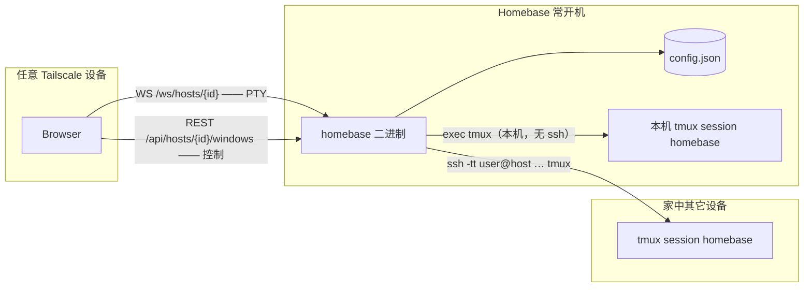

# Homebase 技术方案

| 字段 | 值 |
| --- | --- |
| 状态 | Accepted |
| 日期 | 2026-08-20 |
| 范围 | V2 |
| 配套 | [`../AGENT.md`](../AGENT.md) 是给实现 agent 的硬合同；本文是理由与细节。 |

Homebase 是跑在家庭常开机器上的 **dumb PTY 桥**：浏览器里的 xterm.js 看到的就是一个普通 tmux 客户端。持久化在 tmux，不在 Homebase。

V2 相对 V1 的核心变化：**一台 host 一个固定 session（`homebase`），侧栏列的是这个 session 里的 tmux window。** 用户不再配置 host/user/session 就能用——默认连本机，不走 ssh。

---

## Overview

问题：家里有几台机器挂着长期 tmux。从笔记本、iPad 回到这些会话，依赖「记得 host、记得 session 名、手动 ssh、手动 attach」。

V1 的方案是让用户把每个 (host, session) 配成一行。实践下来这个心智模型是错的：**用户要的是多个工作区，而 tmux 早就有了——就是 window。** 多开 session 没有意义，配置 session 名更没有意义。

V2 的方案：

- 每台 host 上有且只有一个 tmux session，名字固定 `homebase`。
- 浏览器里只有 **一个** xterm、一条 WebSocket、一个 PTY。
- 侧栏列的是 `homebase` 这个 session 里的 tmux window，增删改切全部走 UI，用户不需要按 `C-b`。
- 左上角是 host 下拉。默认「本机」，零配置、不走 ssh。想连家里其它机器再自己加。

访问路径只有 Tailscale（或显式配置的内网地址）。默认拒绝 `0.0.0.0`。

---

## Background & Motivation

- 会话持久化已经有了：tmux。缺的是 **从任意设备一键回到工作现场** 的入口。
- 现成 Web 终端（gotty / ttyd / Wetty）是「把一个本地进程丢到浏览器」，不做 host 列表，也不默认 `tmux new -A`。
- 用户日常 99% 只用本机。让本机也必须 `ssh-copy-id`、进 known_hosts，是纯粹的入门摩擦。
- 约束来自部署：家庭机器，不想装 Node、不想维护容器、不想公网暴露、一个文件拷过去就能跑。

目标负载：单个操作者，少量 host，一台 host 上十几个 tmux window。不是多租户 SaaS。延迟目标：本机/Tailscale 内击键回显 < 50ms 量级。

---

## Goals & Non-Goals

### Goals

1. 打开页面即用，**零配置**：默认连本机的 `homebase` session，不需要 ssh 配置。
2. 侧栏 = 真实的 tmux window 列表。新建 / 改名 / 删除 / 切换全部点 UI 完成，不需要 `C-b`。
3. 一个 xterm、一条 WS、一个 PTY，完整 VT100/ANSI，能跑 vim / htop / less。
4. 可选的多 host：左上下拉切换，本机固定不可删。
5. 容器尺寸变化实时同步到 pty（`pty.Setsize`）。
6. WebSocket 断线自动重连（1s → 2s → 4s → … cap 30s，不停）。
7. 默认只绑 Tailscale IPv4 或 `127.0.0.1`；远程 SSH 只用已有密钥。
8. 单一静态二进制，`embed` 前端。

### Non-Goals（明确不做）

- 多用户、注册、权限、OAuth
- Electron / Tauri / 任何桌面壳
- `tmux -CC`、自绘分屏
- 一台 host 多个 session（这正是 V2 要去掉的东西）
- 密码登录、保存 SSH 密码
- SFTP、文件传输、会话录像、AI
- 公网暴露、反向代理套件、容器编排
- SQLite / 数据库服务
- tmux pane 的 UI 管理（分屏交给 tmux，`C-b %` 仍然可用）

---

## Key Decisions

| # | 决定 | 理由 |
| --- | --- | --- |
| D1 | 一台 host 一个固定 session `homebase`，侧栏列 tmux window | 用户要的是多工作区，tmux window 就是。多 session 只会让多个 client attach 同一个 session 时互相镜像（同一个 active window），侧栏会变成 N 个一模一样的视图。 |
| D2 | PTY 寿命 = WebSocket 寿命（Model A） | 持久化交给 tmux；重连就再走一遍 `tmux new -A`。无客户端时不白占 ssh。 |
| D3 | **控制通道与 PTY 通道分离** | 往 PTY 里写字节等于替用户打字。侧栏的 list/new/rename/kill/select 必须走独立的、短命的 `tmux` 命令。 |
| D4 | 本机直接 exec tmux，不走 ssh | 去掉 `ssh-copy-id`、known_hosts、四个 ssh 错误码这一整套入门摩擦。远程仍然走 `/usr/bin/ssh`。 |
| D5 | 远程 ssh 加 `ControlMaster=auto` | 控制通道每次点击都是一条新 ssh；不复用连接的话远程 host 每次切窗口要多握手 200–500ms。 |
| D6 | 关掉 tmux 状态栏（`set-option -t homebase status off`） | 侧栏已经是窗口列表，底部再来一条是重复。已验证这是 **session 级** 选项，不污染全局 `status on`。 |
| D7 | 保留 tmux 默认 `automatic-rename on` | 没改过名的窗口名字跟着当前命令走（`zsh` → `vim`），侧栏一眼看出哪个窗口在跑什么。用户手动改名后 tmux 会自动把该窗口的 `automatic-rename` 关掉，名字就固定了——已验证。 |
| D8 | 最后一个 window 禁止删除 | `kill-window` 删掉最后一个会连 session 一起销毁。前端置灰 + 服务端 400 双重拦。这样 AGENT.md「绝不 kill session」那条约束不用放松。 |
| D9 | `/usr/bin/ssh` + argv 数组，不引 SSH 库 | 继承 `~/.ssh/config`、known_hosts、agent、ProxyJump、Tailscale MagicDNS。 |
| D10 | 远端命令 `exec /bin/sh -c '…'` + 显式 PATH | Homebrew tmux 在 `/opt/homebrew/bin`，非 login shell 找不到。登录 shell 可能是 fish/csh，不能写 `{ …; }` 或 `$( )`。 |
| D11 | `BatchMode=yes`，不关 `StrictHostKeyChecking` | 禁止密码；禁止静默接受主机密钥。 |
| D12 | 侧栏轮询而非推送 | 用户仍可能在终端里手敲 `C-b c`，或从 iTerm attach 同一个 session。3s 轮询 + 每次 UI 操作后立即刷新，够了，也不必引入 tmux hooks。页面不可见时暂停轮询。 |
| D13 | 本机 host 是隐式的，不进配置文件 | 它没有任何可配置字段。配置里只有用户自己加的远程 host。 |
| D14 | config bump 到 version 2，丢弃 v1 的 `windows` | 尚未发布，不写迁移代码。v1 文件能正常打开，`windows` 字段被忽略。 |
| D15 | 其余沿用 V1：gorilla/websocket、JSON 配置、零构建前端、Basic Auth 可选 | 见下方 Alternatives。 |

---

## Proposed Design

### 1. 进程与数据流



**两条通道，同一个 host：**

| 通道 | 载体 | 本机 | 远程 |
| --- | --- | --- | --- |
| PTY | WebSocket，长连接 | `tmux new-session -A -s homebase …` | `ssh -tt … 'exec /bin/sh -c …'` |
| 控制 | REST，每次一条短命进程 | `tmux list-windows …` | `ssh … 'exec /bin/sh -c … tmux list-windows …'` |

控制通道 **绝不** 往 PTY 里写字节。

### 2. PTY 寿命（Model A）

**一个浏览器 = 一条 WebSocket = 一个本地进程（本机 tmux 或 ssh）。**

- WS 建立 → spawn，带上当前 cols/rows。
- WS 关闭 → kill 本地进程。远端 tmux server 和 session 一律不碰。
- 重连 → 再跑一遍同样的命令。`new-session -A` 幂等，历史由 tmux 重绘。
- 切 host → 断开当前 WS，连新的。tmux 保状态，什么都不丢。不在后台保留上一个连接。

两个浏览器开同一个 host，就是两个 tmux client attach 同一个 session。这是 tmux 的正常行为。**不加 `-D`**（会把另一个客户端踢掉）。尺寸打架是 tmux 的问题（用户自己的 `window-size` / `aggressive-resize`）。

### 3. 模块划分

| 包 | 职责 |
| --- | --- |
| `internal/config` | JSON 文件、互斥、原子替换、`hosts` 增删改查 |
| `internal/ident` | host / user / label / window name / window index 校验 |
| `internal/tmux` | **控制通道**：list / new / rename / kill / select。本机直接 exec，远程包一层 ssh |
| `internal/session` | **PTY 通道**：`Dialer` 接口 + `LocalDialer`（exec tmux）+ `SSHDialer` |
| `internal/ws` | 一条 WS 一个 Proc，双向管道 + resize |
| `internal/api` | REST `/api/hosts`、`/api/hosts/{id}/windows` |
| `internal/listen` | Tailscale 探测、公网绑定闸门 |
| `internal/auth` | 可选 Basic Auth |

### 4. tmux 命令（不要即兴发挥）

会话名是编译期常量 `homebase`。

#### 4.1 PTY（attach）

```
tmux new-session -A -s homebase [-c DIR] ';' set-option -t homebase status off
```

`';'` 必须作为 **独立且被引用的一个 argv**，否则本机 exec 会把它当 session 名的一部分，远程 `/bin/sh` 会把它当命令分隔符。

`-c DIR` 是 session 的起始目录，**只在本机传**，值是操作者 `$HOME` 解析后的绝对路径。不传的话 session 继承的是 homebase 服务进程自己的 cwd —— 在 launchd 下这个值是任意的。`-A` 在 session 已存在时会忽略 `-c`，所以永远可以安全传入。不要写字面量 `~`：argv 不经过 shell，不会被展开。远程 **不传** `-c`：非交互 ssh 命令本来就落在远端 `$HOME`，而本地路径在远端没有意义。

#### 4.2 控制

| 动作 | 命令 |
| --- | --- |
| 当前目录 | `tmux display-message -p -t homebase '#{pane_current_path}'` |
| 列表 | `tmux list-windows -t homebase -F '#{window_index} #{window_active} #{window_name}'` |
| 新建 | `tmux new-window -t homebase [-c DIR] -P -F '#{window_index}'` |
| 改名 | `tmux rename-window -t homebase:IDX NAME` |
| 删除 | `tmux kill-window -t homebase:IDX`（最后一个拒绝执行） |
| 切换 | `tmux select-window -t homebase:IDX` |

session 还不存在时 `list-windows` 会失败（`can't find session`）。这不是错误：返回空列表，前端显示「连接中」，PTY 连上就会把 session 建出来。

**新建窗口必须落在当前活动窗口的目录。** `new-window` 不带 `-c` 时，继承的是 **执行这条命令的进程**（homebase 服务）的 cwd，而不是 session 里活动 pane 的目录 —— 结果就是不管用户当前在哪个窗口、cd 到了哪里，新窗口永远落在同一个无关目录。所以 `NewWindow` 先用 `display-message` 读 `#{pane_current_path}`，再把它喂给 `-c`。这次查询是 **best-effort**：任何失败（session 还不存在、tmux 抽风）都退化成不带 `-c`，而不是让新建失败。代价是每次新建多一次 tmux 往返。

#### 4.3 本机与远程

本机：`exec.Command(tmuxPath, args...)`，PATH 补上 `/opt/homebrew/bin` 等。tmux 找不到 → `enotmux`。

远程：一条 ssh，远端命令形状固定

```
exec /bin/sh -c 'PATH="$PATH:$HOME/.local/bin:/opt/homebrew/bin:/usr/local/bin:/opt/local/bin"; export PATH; t=`command -v tmux 2>/dev/null`; if [ -z "$t" ]; then echo HOMEBASE_ENOTMUX; exit 127; fi; exec "$t" <每个参数都 POSIX 单引号包过>'
```

- 外层必须是 `exec /bin/sh -c '…'`，因为登录 shell 可能是 fish/csh。
- 内层是 POSIX。用反引号不用 `$( )`（csh 会在某些引号里插值 `$(`）。
- 每个参数先正则校验，再 POSIX 单引号转义。

#### 4.4 固定 ssh flags

```
-tt                              （仅 PTY 通道；控制通道不要 -tt）
-o BatchMode=yes
-o NumberOfPasswordPrompts=0
-o ConnectTimeout=10
-o ServerAliveInterval=15
-o ServerAliveCountMax=3
-o ControlMaster=auto
-o ControlPath=<tmp>/homebase-%C
-o ControlPersist=60
```

`ControlPath` 是 unix socket，macOS 上限 104 字节。用 `os.TempDir()` 拼出来若超长则退回 `/tmp`。

#### 4.5 校验

| 字段 | 规则 |
| --- | --- |
| `label` | 1–64 字符，trim，无控制字符 |
| `host` | DNS label / IPv4 / IPv6 / MagicDNS。无空格、`@`、`;`、`\|`、`&`、`$`、`` ` ``、换行 |
| `user` | `^[A-Za-z0-9._-]+$`，1–32 |
| window name | 1–64 字符，无控制字符（tmux 允许空格） |
| window index | `^[0-9]{1,4}$` |

API 写入口校验一次，`exec.Command` 之前再校验一次。

### 5. WebSocket 协议

`GET /ws/hosts/{id}`，同源。未知 host id：close **4404**，reason `unknown host`。无连接数限额。

| 方向 | 帧 | 内容 |
| --- | --- | --- |
| client → server | binary | 原始 stdin 字节 |
| client → server | text JSON | `{"type":"resize","cols":120,"rows":40}` |
| client → server | text JSON | `{"type":"ping"}` |
| server → client | binary | 原始 stdout 字节 |
| server → client | text JSON | `{"type":"status","state":"connecting\|connected\|disconnected\|error","code":"…","message":"…"}` |
| server → client | text JSON | `{"type":"pong"}` |

未知 `type` 忽略。JSON 畸形 debug 日志后忽略。resize 的 cols/rows `< 1` 或 `> 512` 忽略。

重连时前端先 `term.reset()` 再开新 WS，tmux 重绘。不回放本地 buffer。

### 6. 错误码

| code | 含义 | UI |
| --- | --- | --- |
| `ssh_auth` | Permission denied | 提示 ssh-copy-id（仅远程 host） |
| `ssh_hostkey` | Host key verification failed | 在 Homebase 机器上手动 ssh 一次 |
| `ssh_timeout` | ConnectTimeout | 主机没开机 / Tailscale 不通 |
| `ssh_refused` | connection refused | sshd 没起来 |
| `enotmux` | 本机或远端没有 tmux | 装 tmux |
| `pty_spawn` | 本地 spawn 失败 | 看进程日志 |
| `ws_closed` | socket 没了 | 重连中 |
| `unknown` | 其它 | 显示裁剪过的 stderr |

本机 host 只可能出现 `enotmux` / `pty_spawn` / `ws_closed` / `unknown`。

### 7. 前端结构

- **一个** xterm.js 实例、**一条** WebSocket。切 host 或切 window 都不新建 xterm。
- 左上 host 下拉：第一项固定「本机」，不可编辑不可删；其余是配置里的远程 host，可增删改。
- 侧栏 = 当前 host 的 tmux window 列表。点一项 → `PUT …/windows/{idx}` 带 `{"active":true}`；加号 → `POST …/windows`；改名 → `PUT` 带 `{"name":"…"}`；删除 → `DELETE`（只剩一个时按钮置灰）。
- 每次控制操作成功后立即重新拉一次列表。另外 3s 轮询一次，`document.visibilityState === "hidden"` 时暂停。
- `ResizeObserver` 挂在终端容器上，debounce ~32ms，`fit()` 后发 resize。
- 重连退避：1s → 2s → 4s → 8s → 16s → 30s，停在 30s，永不放弃。收到 `state=connected` 重置。
- 字体用 `system-ui` / `ui-monospace`，不 vendor 字体文件。

### 8. 监听地址

沿用 V1，未改动：

1. `-listen` / `listen_addr` 若设置则用它。
2. 否则 `tailscale ip -4`（2s 超时；PATH，然后 `/opt/homebrew/bin`、`/usr/local/bin`）。
3. 否则 `127.0.0.1`，并 warn 别的设备连不上。
4. 端口来自 `-port` / 配置，默认 `1990`。
5. 解析结果是未指定地址（`0.0.0.0`、`::`）时 **拒绝启动**，除非 `allow_public_bind: true`。`-listen` 不能绕过。

### 9. 配置与 REST

`$XDG_CONFIG_HOME/homebase/config.json` → `~/.config/homebase/config.json`，`-config` 覆盖。缺文件则建目录 0700、写文件 0600。

```json
{
  "version": 2,
  "listen_addr": "",
  "listen_port": 1990,
  "allow_public_bind": false,
  "auth": { "enabled": false, "username": "", "password_bcrypt": "" },
  "hosts": []
}
```

`hosts` 里只有用户加的远程 host，本机不在里面：

```json
{
  "id": "550e8400-e29b-41d4-a716-446655440000",
  "label": "Mac mini",
  "user": "yourname",
  "host": "mac-mini",
  "order": 1
}
```

- `id` 服务端生成；POST 忽略客户端给的 id。保留 id `local` 给本机，不可被占用。
- 写：同目录临时文件 → `fsync` → `rename`。读改写全程持锁。
- 未知字段忽略（v1 的 `windows` 就这样被丢掉）。缺 `version` 当 2。
- 文件损坏或 `version > 2`：拒绝启动，不覆盖。

REST（JSON，同源）：

```
GET    /api/health                        {ok:true, listen:"…"}
GET    /api/hosts                         → [{id,label,user,host,local}]
POST   /api/hosts                         {label,user,host}
PUT    /api/hosts/{id}                    {label,user,host}      id=local → 400
DELETE /api/hosts/{id}                                           id=local → 400
GET    /api/hosts/{id}/windows            → {windows:[{index,name,active}]}
POST   /api/hosts/{id}/windows            → {index}
PUT    /api/hosts/{id}/windows/{index}    {name:"…"} 或 {active:true}
DELETE /api/hosts/{id}/windows/{index}    只剩一个 → 400
```

变更类请求要求 `Origin` 的 host 与请求 host 一致（Basic Auth 下的 CSRF 保险）。缺 `Origin`（curl）放行。

远程 host 上限 **16**。POST 超限返回 400。

### 10. 认证

默认关。`auth.enabled` 时：

- 所有路由都要 Basic Auth，包括 WS 升级。
- 密码存 bcrypt，`bcrypt.CompareHashAndPassword`；用户名常数时间比较。
- 浏览器已经为 `GET /` 发过 Basic，同源 `new WebSocket` 会复用。不要把 token 放进 query。
- `homebase hash-password` 从 stdin 读一行，stdout 打 bcrypt。不要把密码放进 argv。

### 11. UI 视觉

深色、暖调、低对比噪音。左侧栏窄，主区就是终端。移动端侧栏抽屉化，靠汉堡按钮开合——这正是「不要求用户按 `C-b`」的主要理由。

---

## Alternatives Considered

### A. 固定一个 session，但侧栏每项各开一个 xterm/WS

不行。多个 tmux client attach 同一个 session 会共享 active window：在一个里切窗口，其它全跟着切，打字互相串。侧栏会变成 N 个一模一样的镜像。

### B. grouped session（`new-session -t homebase -s view-<id>`）

能让每个视图独立切换窗口，但会留下一堆 view session 需要在断开时清理，且用户心智里凭空多出一层。收益不抵复杂度。

### C. 不要侧栏，全交给 tmux 状态栏和 `C-b`

代码最少，最「dumb PTY 桥」。否掉的理由只有一个但足够硬：手机上点一下比按 `C-b 2` 容易得多，而移动端正是这个产品的主场景。

### D. `tmux -CC` control mode

会取消服务端绘制，网页里就跑不了 tmux 自己的 UI 和任意 TUI。禁用。

### E. 控制通道复用 PTY（往 PTY 写 `C-b` 序列）

等于替用户打字：用户正在 vim 里，注入的按键会进 vim。必须是独立进程。

### F. 服务端常驻 PTY（Model B）

无客户端时白占 ssh 连接，还要自己做输出环形缓冲——而 tmux 已经做了这件事。

### G. `golang.org/x/crypto/ssh` 替代 `/usr/bin/ssh`

要自己实现 `~/.ssh/config`、ProxyJump、agent、known_hosts、ControlMaster。得不偿失。

### H. SQLite

配置就十几行，原子 rename 足够。

### I. Vite + 前端打包

部署机不装 Node 是硬要求。

### J. 默认听 `0.0.0.0` 靠 Tailscale ACL 兜底

一个配置失误就等于公网 shell。默认必须安全。

---

## Security & Privacy

- SSH：只用已有密钥。不接受、不存储、不提示、不记录密码。`BatchMode=yes`，不关 `StrictHostKeyChecking`，没有 `sshpass`。
- 本机通道根本不碰 ssh，攻击面更小——它以 Homebase 进程自身的身份跑 tmux。**这意味着能打开页面的人就能在这台机器上执行任意命令**，所以监听地址闸门和 Basic Auth 是唯一的边界。
- 默认拒绝绑未指定地址。
- 日志里绝不出现 PTY 内容、token、bcrypt、Authorization 头。ssh stderr 裁剪到 200 字节且只取首行。
- 删 host 配置只影响本地；不碰远端 tmux。
- 删 window 用 `kill-window`，永不 `kill-session` / `kill-server`；最后一个 window 拒绝删除。
- 配置目录 0700，文件 0600。

## Observability

- 启动时 INFO 打一次实际绑定地址和配置路径。
- WS 开/关各一条 INFO，带 host id 和 label，不带任何 PTY 字节。
- 控制命令失败打 INFO，带裁剪过的 stderr。
- resize、畸形 JSON 走 DEBUG。

## Risks

| 风险 | 缓解 |
| --- | --- |
| 本机通道让「能打开页面 = 能执行命令」 | 默认只绑 Tailscale / loopback；同 tailnet 有别人时建议开 Basic Auth。README 明写。 |
| 远程 host 每次点击一条 ssh，延迟明显 | `ControlMaster=auto` + `ControlPersist=60` 复用连接。 |
| `ControlPath` 超过 unix socket 104 字节上限 | 拼完检查长度，超长退回 `/tmp/homebase-%C`。 |
| 用户在终端里手敲 `C-b c`，侧栏不同步 | 3s 轮询；页面不可见时暂停。 |
| 关掉状态栏影响从 iTerm attach 同一 session 的视图 | 已知且接受：这是 session 级选项。用户真需要可在自己的 tmux 里 `set status on`。 |
| 删到最后一个 window 把 session 一起干掉 | 前端置灰 + 服务端 400。 |
| 进程没有 UTF-8 locale（launchd 就是这样）导致 `-F` 输出被改写 | 分隔符只用空格，不用 tab —— tmux 会把 `-F` 里的控制字符写成 `_`；同时 `ExecEnv` 在父进程没有 `LANG`/`LC_*` 时补一个 `LANG=en_US.UTF-8`。有 live 回归测试。 |
| tmux 版本差异导致 `-F` 格式串不识别 | 用的都是 tmux 1.8+ 就有的 `#{window_index}` / `#{window_name}` / `#{window_active}`。 |

## References

- tmux(1)：`new-session -A`、`list-windows -F`、`kill-window`、`rename-window`、`select-window`、`set-option -t`
- ssh_config(5)：`ControlMaster`、`ControlPath`、`ControlPersist`、`BatchMode`
- xterm.js 5.5.0 + `@xterm/addon-fit`、`@xterm/addon-unicode11`（后者需要 `allowProposedApi: true`）
